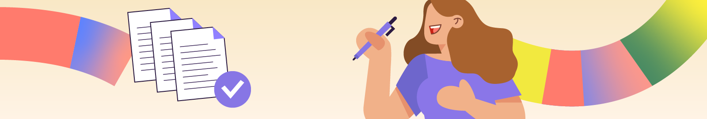

# Booki

The company aims to develop a website that allows users to find accommodations and activities in the city of their choice.

You are tasked with integrating the website interface with HTML and CSS code. For this, you work closely with Sarah, the CTO, and Loïc, the UI designer.

Sarah sends you an email to present the progress of the project.

## 🚀 Subject: Booki Website Mockups

**From**: Sarah

**To**: Me

Hello,

Loïc has finalized the desktop, tablet, and mobile mockups of the website! You will be able to integrate them. They are available as attachments.

To ensure clarity in the project, Loïc and I have prepared a summary note that includes the specifications and technical constraints to follow (see attachment).

To help you get started, I have prepared the file structure of the website and a base of code:

-   an "index.html" file containing an initial HTML code base that you will need to complete;
-   a "css" folder containing one or more "style.css" files with an initial draft of CSS code that you will also need to complete;
-   an "images" folder containing all the images used on the site.

This code is already somewhat developed and will provide you with the initial HTML and CSS elements. You can use it as inspiration to develop the rest of the code, and you must maintain the same folder structure. You will then need to send me this complete folder via GitHub. Also, remember to version your project on Git throughout your development.

Good luck with this project, and have a great day!
Sarah, CTO @Booki

## 🏗️ Project Structure

```<name of the language>
📁 project_folder/
│
├── 📄 index.html
│
├── 📁 css/
│   └── 📄 style.css
│
└── 📁 images/
    ├── 🖼️ image1.jpg
    ├── 🖼️ image2.png
    └── ...
```

## 🛠️ Used languages

In this project, we primarily use the following languages:

| Langage                                                             |
| ------------------------------------------------------------------- |
|  HTML |
|  CSS    |
